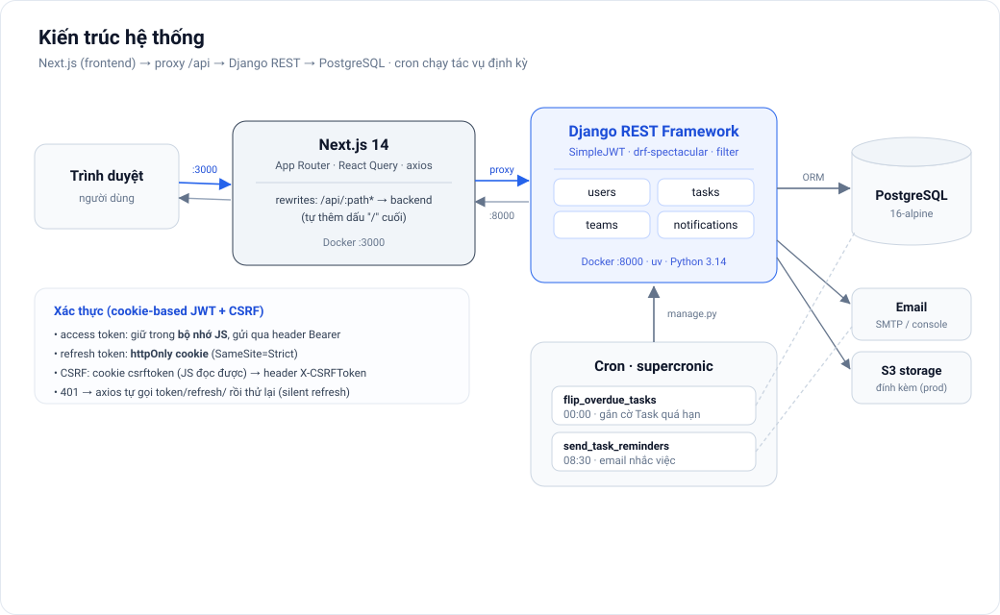
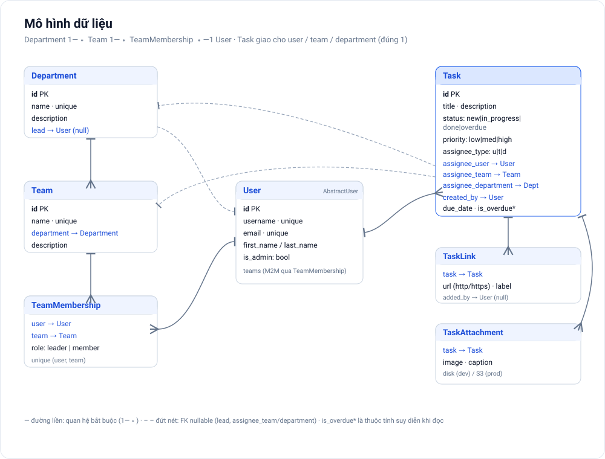
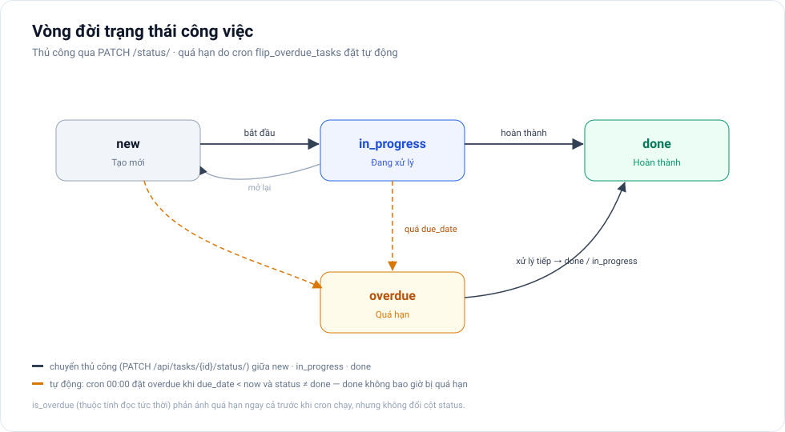

# Internal Task Management — Hệ thống quản lý công việc nội bộ

Ứng dụng web full-stack quản lý công việc cho phòng/nhóm: tạo việc, giao việc, theo dõi tiến độ và cập nhật trạng thái. Mục tiêu mô phỏng quy trình quản lý task trong doanh nghiệp, đồng thời là dự án học/thực hành **Next.js + Django REST + PostgreSQL**.

Repo gồm hai phần: **`frontend/`** (Next.js) và **`backend/`** (Django REST API), chạy chung bằng Docker Compose.

## 1. Tính năng chính

1. **Cơ cấu tổ chức:** quản lý **Phòng ban → Nhóm → Nhân viên** — ba thực thể lồng nhau trong một công ty.
2. **Quản lý công việc:** CRUD task kèm **phân trang, tìm kiếm và lọc** (theo trạng thái, độ ưu tiên, đối tượng được giao, nhóm, phòng ban, cờ quá hạn).
3. **Giao việc** cho **một cá nhân, một nhóm, hoặc một phòng ban** — hệ thống gửi email thông báo tới người/leader liên quan.
4. **Vòng đời trạng thái:** `new → in_progress → done`; khi quá `due_date` mà chưa hoàn thành, **job cron tự động** chuyển sang `overdue`.
5. **Nhắc việc định kỳ:** mỗi sáng gửi email tổng hợp các việc **đến hạn hôm nay** và **quá hạn** cho người phụ trách.
6. **Tài liệu đính kèm:** gắn **link** (http/https) và **ảnh** vào task (lưu đĩa ở dev, S3 ở production).
7. **Dashboard thống kê:** đếm số task theo trạng thái / người phụ trách / nhóm / phòng ban (biểu đồ Recharts).
8. **Xác thực & phân quyền:** JWT cookie-based (access token trong bộ nhớ, refresh token trong httpOnly cookie) + CSRF; RBAC ba vai trò `admin`, `leader`, `member`.
9. **API docs:** OpenAPI/Swagger UI qua `drf-spectacular`.

## 2. Kiến trúc tổng quan

<p align="center">
  
</p>

- **Frontend:** Next.js 14 (App Router) + React 18 + TypeScript, UI bằng Tailwind CSS, quản lý server-state bằng **TanStack Query**, gọi API bằng **axios**, biểu đồ **Recharts**.
- **Proxy:** trình duyệt gọi `/api/*` trên chính origin Next.js; `next.config.mjs` **rewrite** sang backend và **tự thêm dấu `/` cuối** (Django `APPEND_SLASH`). Nhờ đi cùng origin nên cookie hoạt động mà không cần bật CORS credentials.
- **Backend:** Django + Django REST Framework (generic views), lọc bằng `django-filter`.
- **Xác thực:** SimpleJWT theo cơ chế cookie — refresh token nằm trong **httpOnly cookie** (`SameSite=Strict`), access token trả trong body và giữ trong **bộ nhớ JS**; ghi/xoá state đổi trạng thái được bảo vệ **CSRF**.
- **Database:** PostgreSQL 16.
- **Tác vụ định kỳ:** management command chạy theo lịch bằng **supercronic** trong service `cron` riêng — **không dùng Celery/Redis**.
- **Email:** Django email backend (console ở dev, SMTP ở production), dispatch trong **thread nền**.
- **Lưu file:** đĩa cục bộ ở dev; **S3 (`django-storages`)** với presigned URL ở production.
- **Đóng gói:** Docker + Docker Compose (`db`, `backend`, `cron`, `frontend`); backend quản lý gói bằng **uv**.

## 3. Tech stack

| Lớp | Công nghệ |
|-----|-----------|
| Frontend | Next.js 14 (App Router), React 18, TypeScript, Tailwind CSS, TanStack Query, axios, Recharts, lucide-react |
| Backend | Python 3.14 (uv), Django ≥ 6.0, Django REST Framework, SimpleJWT, drf-spectacular, django-filter, django-cors-headers |
| Database | PostgreSQL 16 (`psycopg2-binary`) |
| Lưu file | `django-storages[s3]` + `pillow` (validate ảnh) |
| Tác vụ định kỳ | Management command chạy bằng **supercronic** (không Celery/Redis) |
| Test | Backend: pytest, pytest-django, pytest-cov, factory-boy, `moto[s3]`. Frontend/E2E: Playwright |
| Chất lượng code | Ruff (lint + format), pre-commit |
| DevOps | Docker, Docker Compose, GitHub Actions (lint · test · e2e) |

## 4. Mô hình dữ liệu (data model)

<p align="center">
  
</p>

> **Phạm vi:** ứng dụng phục vụ **một công ty** (single-tenant). "Công ty" là gốc ngầm định, *chưa* tách thành bảng riêng; nếu sau cần nhiều công ty, thêm bảng `Company` đứng trên `Department`. Ba thực thể **Phòng ban, Nhóm, Nhân viên** lồng nhau: `Department 1—∗ Team 1—∗ User` (nhân viên thuộc nhóm qua `TeamMembership`, nhóm thuộc phòng ban).

### Department (Phòng ban) — `apps/teams`
| Trường | Kiểu | Ghi chú |
|--------|------|---------|
| id | int (PK) | |
| name | string | duy nhất |
| description | text | |
| lead | FK → User (null) | lãnh đạo phòng ban; nhận thông báo khi giao việc cho cả phòng |
| created_at / updated_at | datetime | tự động |

### Team (Nhóm) — `apps/teams`
| Trường | Kiểu | Ghi chú |
|--------|------|---------|
| id | int (PK) | |
| name | string | duy nhất |
| department | FK → Department | `on_delete=PROTECT` — nhóm thuộc một phòng ban |
| description | text | |
| created_at / updated_at | datetime | tự động |

### TeamMembership (Nhân viên ∈ Nhóm) — `apps/teams`
| Trường | Kiểu | Ghi chú |
|--------|------|---------|
| user | FK → User | |
| team | FK → Team | |
| role | enum | `leader` \| `member` — **leader** của nhóm nhận thông báo khi giao việc cho nhóm |
| created_at | datetime | tự động |

> Ràng buộc `unique (user, team)`: một người chỉ có một membership trong mỗi nhóm. Phòng ban của nhân viên suy ra từ `team.department`.

### User (mở rộng từ Django `AbstractUser`) — `apps/users`
| Trường | Kiểu | Ghi chú |
|--------|------|---------|
| id | int (PK) | |
| username | string | duy nhất; dùng để đăng nhập |
| email | string | **duy nhất**; dùng để gửi thông báo |
| first_name / last_name | string | |
| is_admin | bool | quyền quản trị toàn hệ thống (vai trò `admin`) |
| teams | M2M → Team | qua `TeamMembership` (`related_name="members"`) |

> **Vai trò (role):** `admin` là cờ cấp hệ thống (`is_admin`); `leader` / `member` là vai trò **theo từng nhóm** qua `TeamMembership.role` — một người có thể là leader nhóm này, member nhóm khác.

### Task — `apps/tasks`
| Trường | Kiểu | Ghi chú |
|--------|------|---------|
| id | int (PK) | |
| title | string | bắt buộc |
| description | text | |
| status | enum | `new` \| `in_progress` \| `done` \| `overdue` (mặc định `new`) |
| priority | enum | `low` \| `medium` \| `high` (tùy chọn) |
| assignee_type | enum | `user` \| `team` \| `department` |
| assignee_user | FK → User (null) | set khi `assignee_type = user` |
| assignee_team | FK → Team (null) | set khi `assignee_type = team` |
| assignee_department | FK → Department (null) | set khi `assignee_type = department` |
| created_by | FK → User | `on_delete=PROTECT` — người tạo |
| due_date | datetime (null) | mốc deadline để tính quá hạn |
| created_at / updated_at | datetime | tự động |

> **Ràng buộc giao việc:** đúng **một** trong `assignee_user / assignee_team / assignee_department` được set, khớp với `assignee_type` (validate ở serializer khi tạo và khi PATCH).
>
> **`is_overdue` (property, không phải cột):** trả `True` khi `due_date < now` và `status ≠ done`. Serializer trả kèm cờ này để client thấy quá hạn tức thời, còn cột `status = overdue` do job cron ghi (xem §6).

### TaskLink — `apps/tasks`
| Trường | Kiểu | Ghi chú |
|--------|------|---------|
| task | FK → Task | `on_delete=CASCADE`, `related_name="links"` |
| url | url | tối đa 500 ký tự; chỉ chấp nhận scheme `http`/`https` |
| label | string | nhãn hiển thị (tùy chọn) |
| added_by | FK → User (null) | |
| created_at | datetime | tự động |

### TaskAttachment — `apps/tasks`
| Trường | Kiểu | Ghi chú |
|--------|------|---------|
| task | FK → Task | `on_delete=CASCADE`, `related_name="attachments"` |
| image | image | validate định dạng & dung lượng; lưu đĩa (dev) hoặc S3 (prod) |
| caption | string | chú thích (tùy chọn) |
| added_by | FK → User (null) | |
| created_at | datetime | tự động |

## 5. Phân quyền (RBAC)

Ba vai trò: **`admin`** (cờ `is_admin`, quản trị toàn hệ thống), **`leader`** (leader nhóm hoặc lead phòng ban), **`member`** (nhân viên). Logic nằm ở [`apps/tasks/permissions.py`](backend/apps/tasks/permissions.py) và [`apps/users/permissions.py`](backend/apps/users/permissions.py).

| Hành động | admin | leader | member |
|-----------|:---:|:---:|:---:|
| Quản lý phòng ban / nhóm / thành viên (CRUD) | ✅ | ❌ | ❌ |
| Quản lý người dùng (list) | ✅ | ❌ | ❌ |
| Tạo / giao task | ✅ (mọi task) | ✅ (trong nhóm/phòng mình phụ trách) | ❌ |
| Sửa / xoá task | ✅ | ✅ (task mình tạo hoặc quản lý được assignee) | ✅ (task mình tạo) |
| Xem task | tất cả | task liên quan (tạo/được giao/nhóm/phòng phụ trách) | task liên quan tới mình |
| Cập nhật trạng thái task được giao | ✅ | ✅ | ✅ |
| Nhận email khi nhóm/phòng được giao việc | — | ✅ (leader đơn vị) | ❌ |

- **`CanCreateTask`** — chỉ admin hoặc người đang là leader/lead ở đâu đó mới được tạo & giao việc; ai cũng được đọc.
- **`CanEditTask`** — sửa/xoá nếu là admin, người tạo, hoặc người quản lý được assignee; đọc theo phạm vi `visible_tasks(user)`.
- **`CanDeleteTaskItem`** — xoá link/ảnh nếu là người thêm hoặc người có quyền sửa task.
- **`IsAdmin`** — dùng cho toàn bộ endpoint users/teams/departments.

## 6. Trạng thái công việc & tác vụ định kỳ

<p align="center">
  
</p>

Hai management command chạy theo lịch qua **supercronic** ([`backend/deploy/crontab`](backend/deploy/crontab), múi giờ `Asia/Ho_Chi_Minh`):

| Lịch | Command | Việc |
|------|---------|------|
| `0 0 * * *` (00:00) | [`flip_overdue_tasks`](backend/apps/tasks/management/commands/flip_overdue_tasks.py) | Đặt `status = overdue` cho task có `due_date < now` và `status ∉ {done, overdue}`. |
| `30 8 * * *` (08:30) | [`send_task_reminders`](backend/apps/notifications/management/commands/send_task_reminders.py) | Gửi email tổng hợp việc đến hạn hôm nay + quá hạn cho từng người phụ trách. |

Chạy thủ công (trong container):

```bash
docker compose exec backend uv run python manage.py flip_overdue_tasks
docker compose exec backend uv run python manage.py send_task_reminders
```

## 7. Xác thực (cookie-based JWT + CSRF)

Frontend giữ **access token trong bộ nhớ** và **refresh token trong httpOnly cookie**, nên JS không đọc được refresh token (giảm rủi ro XSS). Cấu hình cookie ở [`core/settings/base.py`](backend/core/settings/base.py) (`AUTH_REFRESH_COOKIE=refresh_token`, `path=/api/users/`, `httponly=True`, `SameSite=Strict`, `Secure` bật ở production) và các view ở [`apps/users/views.py`](backend/apps/users/views.py) + [`apps/users/cookies.py`](backend/apps/users/cookies.py).

Luồng chính:

1. **Login** — `POST /api/users/login/` trả `{ access }` trong body và set cookie `refresh_token` (httpOnly). Frontend lưu access token vào bộ nhớ.
2. **Gọi API** — axios đính `Authorization: Bearer <access>`; với request đổi state (POST/PUT/PATCH/DELETE) frontend gọi `GET /api/users/csrf/` trước để có cookie `csrftoken`, rồi gửi kèm header `X-CSRFToken`.
3. **Silent refresh** — khi gặp `401`, axios tự gọi `POST /api/users/token/refresh/` (đọc refresh token từ cookie, có xoay vòng) để lấy access token mới rồi thử lại request — logic ở `frontend/src/lib/api.ts`.
4. **Logout** — `POST /api/users/logout/` blacklist refresh token và xoá cookie.

> `token/refresh/` và `logout/` được bảo vệ `@csrf_protect`; `CSRFView` dùng `@ensure_csrf_cookie` để phát cookie `csrftoken` (không httpOnly để JS đọc và echo lại vào header).

## 8. Thông báo qua email — `apps/notifications`

App `notifications` **không có model** (không lưu DB); nó chỉ dựng và gửi email từ [`services.py`](backend/apps/notifications/services.py):

- **Khi giao việc** (`notify_task_assignment`): gửi tới người được giao — với `team` gửi cho **các leader** của nhóm, với `department` gửi cho **lead** phòng ban. Mẫu: [`task_assigned.txt`](backend/apps/notifications/templates/notifications/task_assigned.txt).
- **Nhắc việc** (`send_task_reminders`): gom việc theo người thành hai nhóm *đến hạn hôm nay* / *quá hạn*. Mẫu: [`task_reminder.txt`](backend/apps/notifications/templates/notifications/task_reminder.txt).
- Email được **dispatch trong thread nền** (`_dispatch`) — không dùng Celery/Redis. Deep-link trong email dựng từ `FRONTEND_URL`.

## 9. API chính (REST)

Base path: `/api/`. Trình duyệt gọi qua Next.js proxy (`/api/*` → backend, tự thêm `/` cuối). Access token gửi ở header `Authorization: Bearer <token>`; request đổi state cần header `X-CSRFToken`.

### Auth & Users — `/api/users/`
| Method | Endpoint | Quyền | Mô tả |
|--------|----------|-------|-------|
| POST | `/api/users/register/` | AllowAny | Đăng ký người dùng mới |
| POST | `/api/users/login/` | AllowAny | Đăng nhập → trả `access`, set cookie `refresh_token` |
| POST | `/api/users/token/refresh/` | AllowAny (CSRF) | Đọc refresh cookie, xoay vòng, trả access mới |
| GET | `/api/users/csrf/` | AllowAny | Phát cookie `csrftoken` (204) |
| POST | `/api/users/logout/` | Auth (CSRF) | Blacklist refresh token + xoá cookie |
| GET | `/api/users/profile/` | Auth | Thông tin người dùng hiện tại (kèm memberships) |
| GET | `/api/users/` | Admin | Danh sách người dùng |

### Teams & Departments — `/api/teams/`, `/api/departments/` (Admin)
| Method | Endpoint | Mô tả |
|--------|----------|-------|
| GET / POST | `/api/departments/` | Danh sách / tạo phòng ban |
| GET / PUT / DELETE | `/api/departments/{id}/` | Chi tiết / sửa / xoá phòng ban |
| GET / POST | `/api/teams/` | Danh sách / tạo nhóm |
| GET / PUT / DELETE | `/api/teams/{id}/` | Chi tiết / sửa / xoá nhóm |
| POST | `/api/teams/{team_id}/members/` | Thêm thành viên (user + role) vào nhóm |
| GET / PUT / DELETE | `/api/teams/{team_id}/members/{user_id}/` | Xem / đổi role / gỡ thành viên |

### Tasks — `/api/tasks/`
| Method | Endpoint | Quyền | Mô tả |
|--------|----------|-------|-------|
| GET | `/api/tasks/` | Auth | Danh sách task trong phạm vi nhìn thấy (phân trang, filter, search) |
| POST | `/api/tasks/` | Auth + CanCreateTask | Tạo & giao task |
| GET | `/api/tasks/stats/` | Auth | Thống kê: `total`, `by_status`, `by_assignee_user`, `by_team`, `by_department` |
| GET / PUT / PATCH / DELETE | `/api/tasks/{id}/` | Auth + CanEditTask | Chi tiết / cập nhật / xoá task |
| PATCH | `/api/tasks/{id}/status/` | Auth | Cập nhật riêng `status` (chỉ `new` \| `in_progress` \| `done`; `overdue` do hệ thống đặt) |
| GET / POST | `/api/tasks/{task_id}/attachments/` | Auth | Liệt kê / tải ảnh đính kèm |
| DELETE | `/api/tasks/{task_id}/attachments/{id}/` | Auth + CanDeleteTaskItem | Xoá ảnh đính kèm |
| GET / POST | `/api/tasks/{task_id}/links/` | Auth | Liệt kê / thêm link |
| DELETE | `/api/tasks/{task_id}/links/{id}/` | Auth + CanDeleteTaskItem | Xoá link |

Khi tạo task, body chứa `assignee_type` (`user`\|`team`\|`department`) cùng đúng một trong `assignee_user` / `assignee_team` / `assignee_department`.

**Query params cho `GET /api/tasks/`:** `status`, `priority`, `assignee_type`, `assignee_user`, `team`, `department`, `is_overdue`, `search` (title/description), `page`, `page_size` (mặc định 20, tối đa 100).

### Hệ thống
| Method | Endpoint | Mô tả |
|--------|----------|-------|
| GET | `/api/health/` | Health check (AllowAny) |
| GET | `/api/schema/` | OpenAPI schema |
| GET | `/api/docs/` | Swagger UI |
| — | `/admin/` | Django admin |

## 10. Cấu trúc thư mục

```
Internal Task Management Project/
├── frontend/                       # Next.js 14 (App Router)
│   ├── src/
│   │   ├── app/                    # /, /login, /register, /tasks, /tasks/[id],
│   │   │                           # /tasks/new, /dashboard, /account
│   │   ├── components/             # Header, TaskForm, landing, ui/
│   │   └── lib/                    # api.ts (axios), auth*, hooks, types
│   ├── e2e/                        # Playwright: auth, task-lifecycle, edit-delete, search-filter
│   ├── next.config.mjs             # rewrite /api/* → backend
│   └── Dockerfile · package.json
├── backend/
│   ├── core/                       # settings/ (base·development·production), urls, wsgi, asgi
│   ├── apps/
│   │   ├── users/                  # User, cookie-JWT auth, CSRF, permissions
│   │   ├── teams/                  # Department, Team, TeamMembership
│   │   ├── tasks/                  # Task, TaskLink, TaskAttachment, filters, permissions
│   │   │   └── management/commands/flip_overdue_tasks.py
│   │   └── notifications/          # services, templates, send_task_reminders
│   ├── deploy/crontab              # lịch supercronic
│   ├── Dockerfile · pyproject.toml · uv.lock · manage.py
├── docs/                           # sơ đồ (SVG) cho README
├── docker-compose.yml
└── README.md
```

## 11. Chạy dự án với Docker

```bash
# 1. Chuẩn bị biến môi trường
cp .env.example .env                      # POSTGRES_* cho service db
cp backend/.env.example backend/.env      # cấu hình Django
cp frontend/.env.example frontend/.env    # BACKEND_INTERNAL_URL

# 2. Build & khởi động toàn bộ stack
docker compose up --build

# Frontend: http://localhost:3000
# Backend:  http://localhost:8000
# Swagger:  http://localhost:8000/api/docs/
```

`docker-compose.yml` gồm bốn service:

| Service | Vai trò |
|---------|---------|
| `db` | PostgreSQL 16 (cổng `5432`, healthcheck `pg_isready`) |
| `backend` | Django dev server (`runserver 0.0.0.0:8000`, cổng `8000`) |
| `cron` | Chạy `migrate` rồi `supercronic /app/deploy/crontab` (múi giờ `Asia/Ho_Chi_Minh`) |
| `frontend` | Next.js dev server (`npm run dev`, cổng `3000`) |

Các lệnh quản trị backend thường dùng:

```bash
docker compose exec backend uv run python manage.py migrate
docker compose exec backend uv run python manage.py createsuperuser
```

> `createsuperuser` tạo tài khoản Django admin (`is_staff`/`is_superuser`). RBAC của app dựa trên cờ **`is_admin`** — bật thêm cờ này nếu muốn tài khoản đó có quyền `admin` của hệ thống (vd. qua Django admin hoặc shell).

## 12. Chạy test & chất lượng code

**Backend** — pytest + pytest-django, tách theo lớp (models / serializers / permissions / views / commands) trong `apps/*/tests/`:

```bash
docker compose exec backend uv run pytest            # toàn bộ + coverage
docker compose exec backend uv run pytest apps/tasks # một app
```

**Frontend E2E** — Playwright (`frontend/e2e/`): các luồng đăng ký/đăng nhập, vòng đời task, sửa/xoá, tìm kiếm/lọc:

```bash
cd frontend && npx playwright test
```

**Ruff** lo lint + format backend ([`backend/pyproject.toml`](backend/pyproject.toml): `target-version = py314`, `line-length = 100`, rule `E,F,I,UP,B,DJ`). **CI** (GitHub Actions) chạy ba job: `lint` (ruff) → `test` (pytest + Postgres) → `e2e` (Playwright + backend seed).

Bật hook để bắt lỗi **trước khi commit**:

```bash
uv tool install pre-commit        # hoặc: pipx install pre-commit / brew install pre-commit
pre-commit install                # đọc .pre-commit-config.yaml
pre-commit run --all-files        # (tùy chọn) chạy thử trên toàn repo
```

## 13. Biến môi trường

| File | Nhóm | Biến |
|------|------|------|
| `.env` (gốc) | Postgres (service db) | `POSTGRES_DB`, `POSTGRES_USER`, `POSTGRES_PASSWORD` |
| `backend/.env` | Django | `DJANGO_SECRET_KEY`, `DJANGO_SETTINGS_MODULE`, `ALLOWED_HOSTS` |
| | Database | `DB_NAME`, `DB_USER`, `DB_PASSWORD`, `DB_HOST`, `DB_PORT` |
| | CORS / CSRF / client | `CORS_ALLOWED_ORIGINS`, `CSRF_TRUSTED_ORIGINS`, `FRONTEND_URL` |
| | Email | `EMAIL_BACKEND`, `EMAIL_HOST`, `EMAIL_PORT`, `EMAIL_HOST_USER`, `EMAIL_HOST_PASSWORD`, `EMAIL_USE_TLS`, `DEFAULT_FROM_EMAIL` |
| | S3 (production) | `AWS_STORAGE_BUCKET_NAME`, `AWS_S3_REGION_NAME`, `AWS_S3_ENDPOINT_URL`, `AWS_PRESIGNED_EXPIRY`, `AWS_ACCESS_KEY_ID`, `AWS_SECRET_ACCESS_KEY` |
| `frontend/.env` | Proxy | `BACKEND_INTERNAL_URL` (đích rewrite; mặc định `http://localhost:8000`) |

JWT: access token sống 30 phút, refresh 7 ngày, có xoay vòng + blacklist (SimpleJWT); refresh token nằm trong httpOnly cookie (xem §7).

---
*Tài liệu kỹ thuật cho dự án học tập cá nhân — Internal Task Management (full-stack).*
